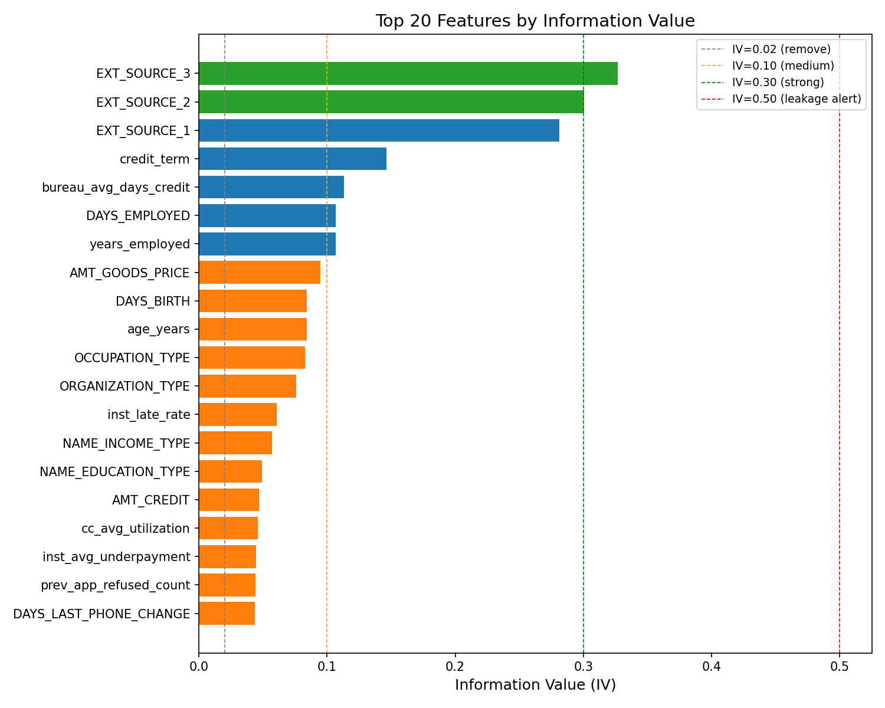

# Feature Fix Report
Date: 2026-03-23

## Shape Summary
- Train before corrections: (215257, 212)
- Test before corrections:  (92254, 212)

## Correção 1 — bureau_had_overdue
- bureau_had_overdue = 1 (had overdue):  49,394 (22.95%)
- bureau_had_overdue = 0 (no overdue):   165,863 (77.05%)
- bureau_max_overdue NaN filled with 0

## Correção 2 — EXT_SOURCE_1 Imputation
- Predictors used: ['EXT_SOURCE_2', 'EXT_SOURCE_3', 'DAYS_BIRTH', 'AMT_CREDIT', 'AMT_INCOME_TOTAL', 'DAYS_EMPLOYED', 'NAME_EDUCATION_TYPE']
- Missing predictors (skipped): []
- Train rows with EXT_SOURCE_1 present (used for fitting): 215,257
- Train rows imputed: 0
- Test rows imputed: 0
- In-sample RMSE: 0.1047
- Model saved: C:\Users\magno\OneDrive\Desktop\pod-bank-credit-score\models\imputer_ext_source_1.pkl
- Flag column created: ext_source_1_imputed (1 = imputed)

## Correção 3 — Dropped Columns
- Columns to drop (specified): 13
- Columns actually dropped: 0
- Dropped: None (all already absent)
- Not found (already absent): ['COMMONAREA_AVG', 'COMMONAREA_MEDI', 'COMMONAREA_MODE', 'NONLIVINGAPARTMENTS_AVG', 'NONLIVINGAPARTMENTS_MEDI', 'NONLIVINGAPARTMENTS_MODE', 'FONDKAPREMONT_MODE', 'LIVINGAPARTMENTS_AVG', 'LIVINGAPARTMENTS_MEDI', 'LIVINGAPARTMENTS_MODE', 'YEARS_BUILD_AVG', 'YEARS_BUILD_MEDI', 'YEARS_BUILD_MODE']

## Correção 4 — Data Leakage Check
- DAYS_* columns checked: ['DAYS_BIRTH', 'DAYS_EMPLOYED', 'DAYS_REGISTRATION', 'DAYS_ID_PUBLISH', 'DAYS_LAST_PHONE_CHANGE']
- No unexpected positive values found in DAYS_* columns.

## Correção 5 — IV Selection
- Features before IV selection: 212
- Features after IV selection: 64
- Removed (IV < 0.02): 148 features
- Removed feature list: ['NONLIVINGAREA_AVG', 'bureau_avg_credit_debt', 'BASEMENTAREA_MODE', 'NONLIVINGAREA_MEDI', 'pos_cash_completed_count', 'ENTRANCES_AVG', 'OWN_CAR_AGE', 'ENTRANCES_MEDI', 'cc_max_balance', 'inst_avg_dpd', 'NAME_CONTRACT_TYPE', 'ENTRANCES_MODE', 'NAME_HOUSING_TYPE', 'FLOORSMIN_AVG', 'LANDAREA_MODE', 'LANDAREA_MEDI', 'LANDAREA_AVG', 'FLOORSMIN_MEDI', 'pos_cash_avg_dpd', 'inst_num_instalments', 'prev_app_avg_annuity', 'bureau_max_overdue', 'ELEVATORS_AVG', 'FLOORSMIN_MODE', 'cc_avg_payment', 'prev_app_approved_count', 'ELEVATORS_MEDI', 'bureau_count', 'NONLIVINGAREA_MODE', 'ELEVATORS_MODE', 'inst_count', 'AMT_INCOME_TOTAL', 'credit_income_ratio', 'pos_cash_max_dpd', 'HOUR_APPR_PROCESS_START', 'prev_app_avg_amount', 'FLAG_OWN_CAR', 'annuity_income_ratio', 'bureau_avg_overdue_months', 'prev_app_consumer_count', 'prev_app_cash_count', 'cc_months_balance', 'DEF_30_CNT_SOCIAL_CIRCLE', 'prev_app_count', 'prev_app_avg_credit', 'pos_cash_late_payments', 'CNT_FAM_MEMBERS', 'AMT_REQ_CREDIT_BUREAU_MON', 'CNT_CHILDREN', 'NAME_TYPE_SUITE']...
- Leakage alerts (IV > 0.50): None

### Top 20 Features by IV
| Feature | IV | Category |
|---|---|---|
| EXT_SOURCE_3 | 0.3266 | STRONG |
| EXT_SOURCE_2 | 0.3007 | STRONG |
| EXT_SOURCE_1 | 0.2811 | MEDIUM |
| credit_term | 0.1463 | MEDIUM |
| bureau_avg_days_credit | 0.1132 | MEDIUM |
| DAYS_EMPLOYED | 0.1067 | MEDIUM |
| years_employed | 0.1067 | MEDIUM |
| AMT_GOODS_PRICE | 0.0946 | WEAK |
| DAYS_BIRTH | 0.0843 | WEAK |
| age_years | 0.0843 | WEAK |
| OCCUPATION_TYPE | 0.0829 | WEAK |
| ORGANIZATION_TYPE | 0.0756 | WEAK |
| inst_late_rate | 0.0606 | WEAK |
| NAME_INCOME_TYPE | 0.0569 | WEAK |
| NAME_EDUCATION_TYPE | 0.0489 | WEAK |
| AMT_CREDIT | 0.0467 | WEAK |
| cc_avg_utilization | 0.0460 | WEAK |
| inst_avg_underpayment | 0.0447 | WEAK |
| prev_app_refused_count | 0.0439 | WEAK |
| DAYS_LAST_PHONE_CHANGE | 0.0436 | WEAK |

## Final Shape Summary
- Train after corrections: (215257, 64)
- Test after corrections:  (92254, 64)

## Final Feature List
Total features: 64

- AMT_ANNUITY
- AMT_CREDIT
- AMT_GOODS_PRICE
- APARTMENTS_AVG
- APARTMENTS_MEDI
- APARTMENTS_MODE
- BASEMENTAREA_AVG
- BASEMENTAREA_MEDI
- CODE_GENDER
- DAYS_BIRTH
- DAYS_EMPLOYED
- DAYS_ID_PUBLISH
- DAYS_LAST_PHONE_CHANGE
- DAYS_REGISTRATION
- EMERGENCYSTATE_MODE
- EXT_SOURCE_1
- EXT_SOURCE_2
- EXT_SOURCE_3
- FLOORSMAX_AVG
- FLOORSMAX_MEDI
- FLOORSMAX_MODE
- HOUSETYPE_MODE
- LIVINGAREA_AVG
- LIVINGAREA_MEDI
- LIVINGAREA_MODE
- NAME_EDUCATION_TYPE
- NAME_FAMILY_STATUS
- NAME_INCOME_TYPE
- OCCUPATION_TYPE
- ORGANIZATION_TYPE
- REGION_POPULATION_RELATIVE
- REGION_RATING_CLIENT
- REGION_RATING_CLIENT_W_CITY
- SK_ID_CURR
- TARGET
- TOTALAREA_MODE
- WALLSMATERIAL_MODE
- YEARS_BEGINEXPLUATATION_AVG
- YEARS_BEGINEXPLUATATION_MEDI
- YEARS_BEGINEXPLUATATION_MODE
- age_years
- bureau_active_count
- bureau_avg_credit_sum
- bureau_avg_days_credit
- bureau_closed_count
- cc_avg_balance
- cc_avg_drawings
- cc_avg_utilization
- cc_max_utilization
- credit_term
- inst_avg_payment_ratio
- inst_avg_underpayment
- inst_late_count
- inst_late_rate
- inst_max_dpd
- inst_min_payment_ratio
- pos_cash_active_count
- pos_cash_avg_dpd_def
- pos_cash_count
- pos_cash_months_balance
- prev_app_approval_rate
- prev_app_last_days
- prev_app_refused_count
- years_employed